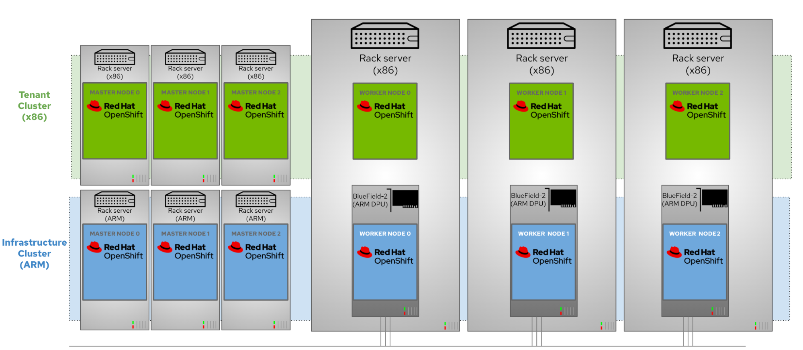
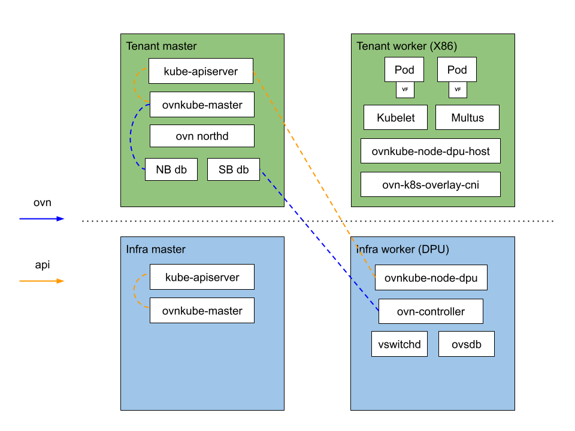

# OCP DPU Support

The goal of this document is to collate all the information related to the architecture
of OCP DPU support in one location.

## Overview
To manage DPUs, Red Hat OpenShift replaces the native DPU OS and is deployed using
a two-cluster design that consists of:
- Tenant cluster running on the host servers (x86)
- Infrastructure cluster running on DPUs (Arm)

The architecture is shown below:

**Figure 1: The two cluster design**

In this architecture, the DPUs are provisioned as worker nodes of the Arm-based OpenShift
infrastructure cluster. This is the blue cluster in Figure 1. The tenant OpenShift cluster,
composed of the x86 servers, is where user applications typically run. This is the green
cluster. In this deployment, each physical server runs both a tenant node on the x86 cores
and an infrastructure node on the DPU Arm cores.

This architecture minimizes the attack surface by decoupling the workload from the management
cluster.

This architecture also streamlines operations by decoupling the application workload from the
underlying infrastructure. That allows IT Ops to deploy and maintain the platform software and
accelerated infrastructure while DevOps deploys and maintains application workloads
independently from the infrastructure layer.

OCP provides capabilities (as tech preview) for offloading OVN and OVS services that typically run
on servers, from the host CPU to the DPU. This is accomplished through the following components:

- DPU Network Operator: This component is used with the infrastructure cluster to facilitate OVN
  deployment.
- DPU mode for OVN Kubernetes: This component is assigned by the cluster network operator for the
  tenant cluster.
- SR-IOV network operator: This component discovers compatible network devices, and provisions them
  for SR-IOV access by pods on that server.
- Kernel flow offloading (TC Flower).

The combination of these components allows us to move ovn-kube-node services from the x86 host to
the DPU.

**Figure 2: Network flows**

The network flows are offloaded in this manner (see Figure 2):

- The ovn-k8s components are moved from the x86 host to the DPU (ovn-kube, vswitchd, ovsdb).
- The Open vSwitch data path is offloaded from the DPU Arm CPU to the NIC ASIC.

The following Open vSwitch datapath flows managed by ovn-k8s are offloaded to the DPU that is running OpenShift:

- Pod to pod (east-west)
- Pod to clusterIP service backed by a regular pod in diff node (east-west)
- Pod to external (north-south)

The following diagram shows the deployment architecture:

**Figure 3: Deployment overview**

## References
- [Orchestrate offloaded network functions on DPUs with Red Hat OpenShift](https://developers.redhat.com/articles/2022/04/26/orchestrate-offloaded-network-functions-dpus-red-hat-openshift#ovn_ovs_offloading_on_nvidia_bluefield_2_dpus)
- [OpenShift deployment architecture](https://access.redhat.com/articles/6804281#installing-and-configuring-an-accelerated-infrastructure-with-openshift-and-dpus-2)