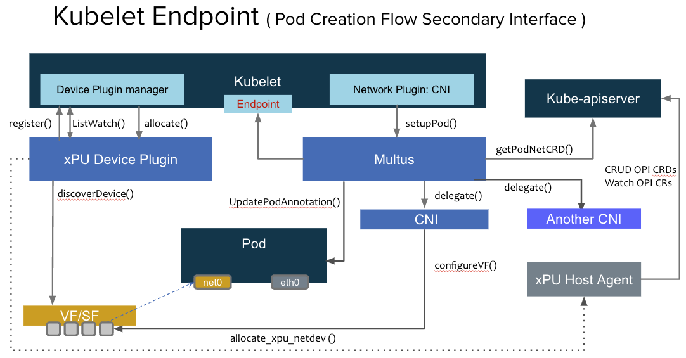

# Host provisioning xPU VF/SF

The main idea behind this document is to specify the flow of VF/SF allocation from the Host POV if the networking infrastructure is provided by a xPU.

## Assumptions

- This is greenfield.

- VFs/SFs are uniquely identified by their PCI address. AKA, PCI address is the same on the Host Server as on the xPU. This is needed to track VFs/SFs as they move through networking namespaces (if_index is not unique).

- At a high level the same scenario will work for both Single Cluster or Multi-cluster.

- This will work for primary or secondary networking.

## Opens

- In the multi-cluster scenarion: is the VF/SF really the primary/only interface for the Pod? How would this work with something like prometheus today (if it's gathering app metrics).

### Provisioning via CRDs

#### Entities and roles

- **xPU Host Agent**
  - CRUDs OPI CRDs (from the Kube-apiserver or the Broker).
  - Processes requests from the Device Plugin or CNI via a gRPC server.
- **xPU Agent**
  - CRUDs OPI CRDs (from the Kube-apiserver or the Broker).
  - Translates those CRDs into real OPI API calls (which it also invokes).
- **Device Plugin**:
  - Provisions and advertises the VFs/SFs to Kubernetes.
  - Interacts with the xPU Host agent to invoke the creation of OPI netdev CRDs
    on Pod allocation.
- **CNI**:
  - Configures the interface with the allocated IP address
  - Moves the VF/SF from the Host network namespace to the Pod Network namespace
   (vice versa).
- **Broker**
  - Syncs OPI CRDs between the Tenant and Infra clusters.

The following high level diagram provides an overview of the entities working
together to provision a primary network interface for a pod.

The following high level diagram provides an overview of the entities working
together to provision a secondary network interface for a pod.

### Single Cluster

The following sequence diagram provides an overview of the entities working
together to provision an interface for a pod in the single cluster scenario.

### Multi Cluster

The following sequence diagram provides an overview of the entities working
together to provision an interface for a pod in the Multi cluster scenario.

