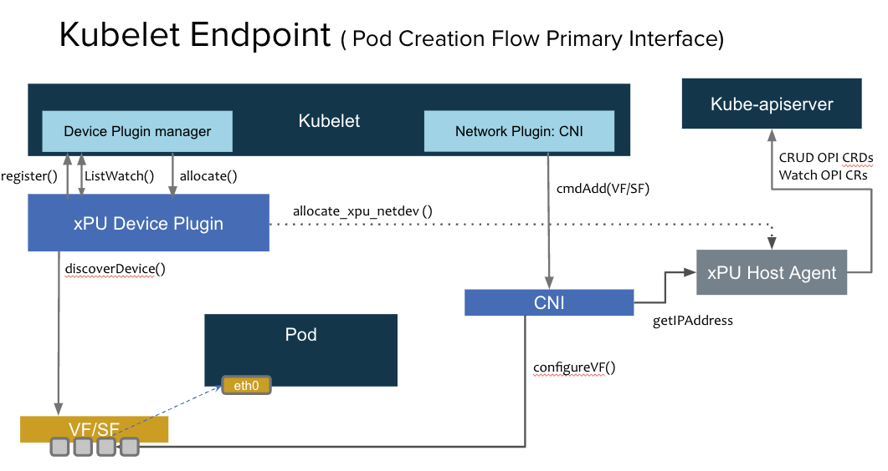
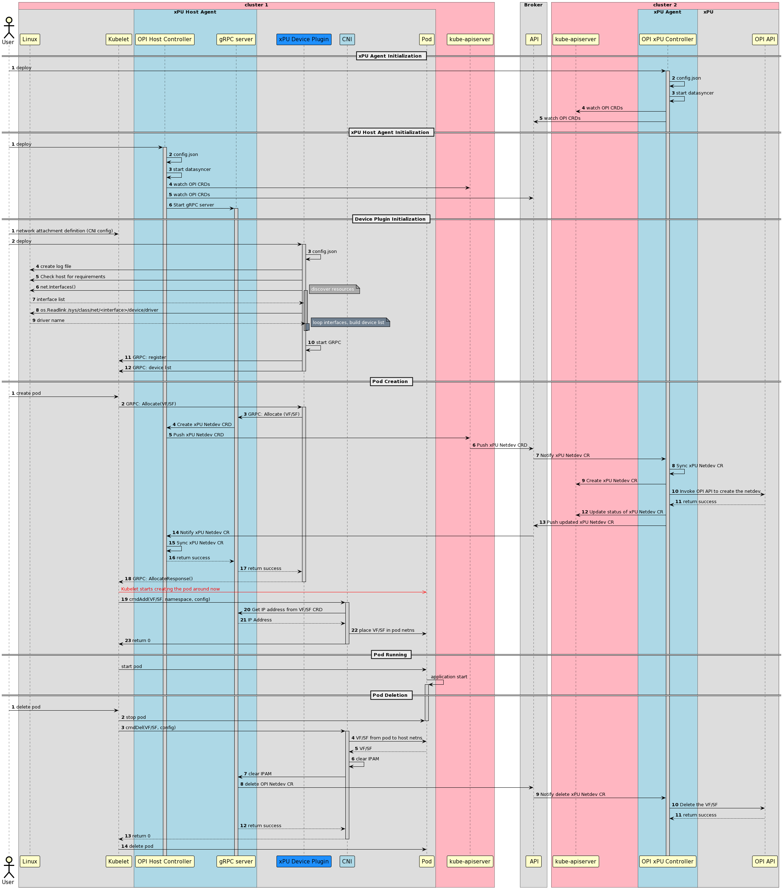

# Host provisioning xPU VF/SF

The main idea behind this document is to specify the flow of VF/SF allocation from the Host POV if the networking infrastructure is provided by a xPU.

## Assumptions

- This is greenfield.

- VFs/SFs are uniquely identified by their PCI address. AKA, PCI address is the same on the Host Server as on the xPU. This is needed to track VFs/SFs as they move through networking namespaces (if_index is not unique).

- At a high level the same scenario will work for both Single Cluster or Multi-cluster.

- This will work for primary or secondary networking.

- Selectors will be used to decide worker nodes to apply the CRDs to.

- Service metrics will be collectable through services that are fully integrated
as a Kubernetes deployment.

- A third cluster will be used as the broker.

- The Kublet will be host networked.

## Opens

- Will this solution scale well across clusters in the two cluster scenario?
- Does the CRD approach make sense in the single cluster scenario? ==> probably not.
- If the infra cluster needs access to many Kubernetes resources in the tenant cluster, does it make sense to have a broker or is direct cluster access a better approach.
- Should we even consider using something like microshift on the DPU in the two cluster scenario.
- Need to think about how nodeport will work.

### Provisioning via CRDs

#### Entities and roles

- **xPU Host Agent**
  - CRUDs OPI CRDs (from the Kube-apiserver or the Broker).
  - Processes requests from the Device Plugin or CNI via a gRPC server.
- **xPU Agent**
  - CRUDs OPI CRDs (from the Kube-apiserver or the Broker).
  - Translates those CRDs into real OPI API calls (which it also invokes).
- **Device Plugin**:
  - Provisions and advertises the VFs/SFs to Kubernetes.
  - Interacts with the xPU Host agent to invoke the creation of OPI netdev CRDs
    on Pod allocation.
- **CNI**:
  - Configures the interface with the allocated IP address
  - Moves the VF/SF from the Host network namespace to the Pod Network namespace
   (vice versa).
- **Broker**
  - Syncs OPI CRDs between the Tenant and Infra clusters.
  - The Broker is a singleton component that is deployed on a cluster whose Kubernetes API must be accessible by all of the participating clusters.
  - The Broker cluster may be one of the participating clusters or a standalone cluster without the other components deployed. The Agent components deployed in each participating cluster are configured with the information to securely connect to the Broker cluster’s API.

The following high level diagram provides an overview of the entities working
together to provision a primary network interface for a pod.



The following high level diagram provides an overview of the entities working
together to provision a secondary network interface for a pod.

TODO

#### Advantages

The main advantage of this approach is that the scope of what is shared across clusters can be limited (in the two cluster scenario), while also allowing us to maintain a relatively simple CNI on the host side.

#### Required CRDs

TODO (WIP)

- Netdev (New)
- Service: reflecting the services in the tenant cluster.
- EndpointSlice: reflecting the endpoint slices in the tenant cluster.
- Network policy

### Single Cluster

The following sequence diagram provides an overview of the entities working
together to provision an interface for a pod in the single cluster scenario.


### Multi Cluster

The following sequence diagram provides an overview of the entities working
together to provision an interface for a pod in the Multi cluster scenario.



## CRDs

## DPUNetworkNodeState

```yaml
TODO WIP
```

References

- [1 Liveliness probes](https://kubernetes.io/docs/tasks/configure-pod-container/configure-liveness-readiness-startup-probes/)
- [2 Configuring dpu devices](https://docs.openshift.com/container-platform/4.12/networking/hardware_networks/configuring-dpu-device.html)
