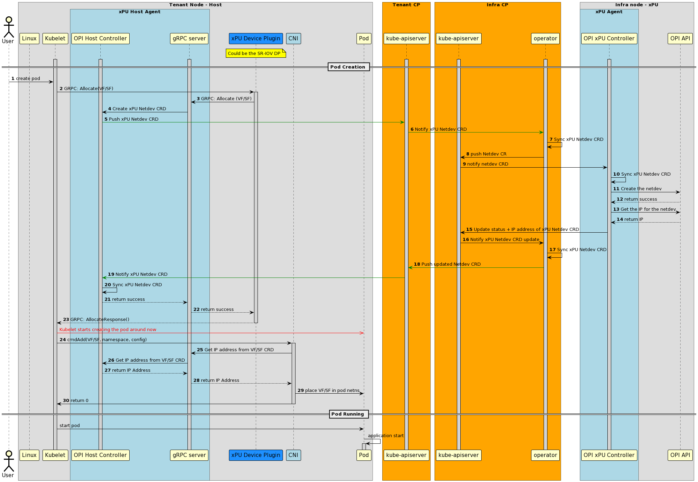

# Host provisioning xPU VF/SF

The main idea behind this document is to specify the flow of VF/SF allocation from the Host POV if the networking infrastructure is provided by a xPU. The main focus of the document will be the two cluster scenario, whereby the x86 host is part of a tenant cluster and the DPU is part of an infrastructure cluster.

## Assumptions

- VFs/SFs are uniquely identified using `SerialNum/PF_id/VF_id`. This is needed to track VFs/SFs as they move through networking namespaces (if_index is not unique).

- While this document focuses on the two cluster scenario, the same solution will work for both Single Cluster or Multi-cluster.

- This will work for primary or secondary networking.

- Selectors will be used to decide worker nodes to apply the CRDs to.

- Service metrics will be collectable through services that are fully integrated as a Kubernetes deployment.

- The Kublet will be host networked.

- The infrastructure (aka the DPU) is the `primary` entity driving/making networking decisions on behalf of the host.

## Opens

- Should we even consider using something like microshift on the DPU in the two cluster scenario.
- How will nodeport will work?
- How to use CNI in hetrogenous deployments. Is CNI delegation something that we need?

### To Broker or not to Broker?

A **Broker** is an entity that could be used to sync OPI CRDs and tenant resources between the Tenant and Infra clusters. It's a singleton component that is deployed on a cluster whose Kubernetes API must be accessible by all of the participating clusters. The Broker cluster may be one of the participating clusters or a standalone cluster without the other components deployed. The Agent components deployed in each participating cluster are configured with the information to securely connect to the Broker cluster’s API.

The proposal is to avoid leveraging a Broker within the xPU Kubernetes architecture as the infra cluster and the tenant cluster are tightly coupled. The infra cluster will need a access to several Kubernetes resources and it does not make sense to replicate these (resources) through CRDs via a Broker. There's also a question of latency introduced by the Broker and whether or not it can scale.

### Provisioning Entities and roles

- **xPU Host Agent**
  - CRUDs OPI CRDs (from the Kube-apiserver or the Broker).
  - Processes requests from the Device Plugin or CNI via a gRPC server.
- **xPU Agent**
  - CRUDs OPI CRDs (from the Kube-apiserver or the Broker).
  - Translates those CRDs into OPI API calls (which it also invokes).
  - Monitors Kubernetes resources in the tenant cluster.
  - Translates those K8s resources into OPI API calls (which it also invokes).
- **Device Plugin**:
  - Provisions and advertises the VFs/SFs to Kubernetes.
  - Interacts with the xPU Host agent to invoke the creation of OPI netdev CRDs
    on Pod allocation.
- **CNI**:
  - Configures the interface with the allocated IP address
  - Moves the VF/SF from the Host network namespace to the Pod Network namespace
   (vice versa).

### Required Resources

A non exhaustive list of resources that need to be shared from the tenant cluster to the infra cluster include:

- Netdev CRD (New)
- Pods
- Service: reflecting the services in the tenant cluster.
- EndpointSlice: reflecting the endpoint slices in the tenant cluster.
- Network policy: reflecting the network policies in the tenant cluster.

### Multi Cluster sequence diagrams

#### Initialization

The following high level diagram provides an overview of the initialization of the entities involved in provisioning an xPU VF to a host.


An alternative option would be to eliminate the host agent, and the sequence diagram for that looks as follows:


#### Pod Creation



An alternative option would be to eliminate the host agent, and the sequence diagram for that looks as follows:


#### Pod Deletion


An alternative option would be to eliminate the host agent, and the sequence diagram for that looks as follows:


## CRDs

### Netdev

```golang
type NetdevStatus string

const (
    Connected NetdevStatus = "connected"
    Connecting NetdevStatus = "connecting"
    Disconnected NetdevStatus = "disconnected"
    ConnectionError NetdevStatus = "error"
)

type NetdevSpec struct {
    NetdevID string `json:"netdev_id"` // SerialNum_PFID_SFID
    Hostname string `json:"hostname"`
    Subnets []string `json:"subnets"` // or maybe other routing info?
    IP string `json:"ip"`
    Backend string `json:"backend,omitempty"` //subfunction or virtual function
    Status NetdevStatus `json:"status"`
}

type Netdev struct {
    metav1.TypeMeta `json:",inline"`
    metav1.ObjectMeta `json:"metadata,omitempty"`
    Spec NetdevSpec `json:"spec"`
}
```

References

- [1 Liveliness probes](https://kubernetes.io/docs/tasks/configure-pod-container/configure-liveness-readiness-startup-probes/)
- [2 Configuring dpu devices](https://docs.openshift.com/container-platform/4.12/networking/hardware_networks/configuring-dpu-device.html)
